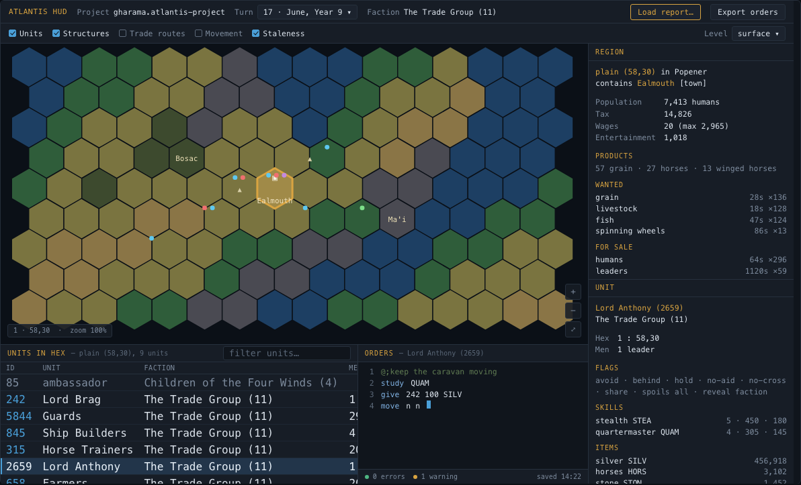
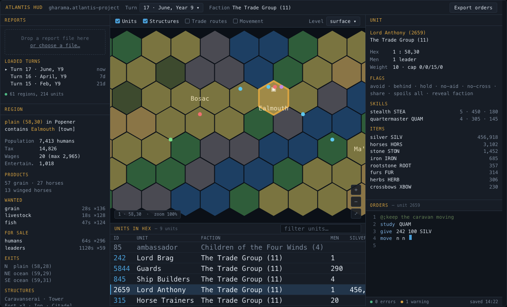
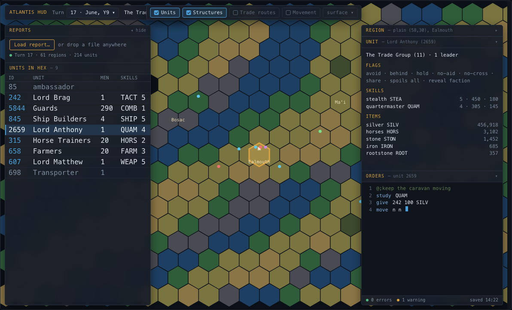
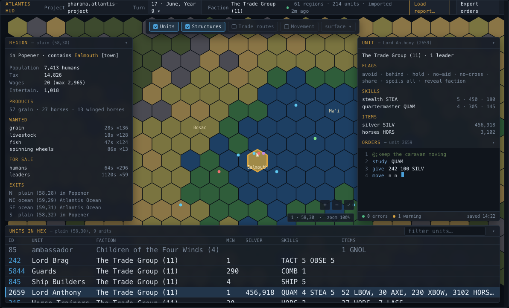
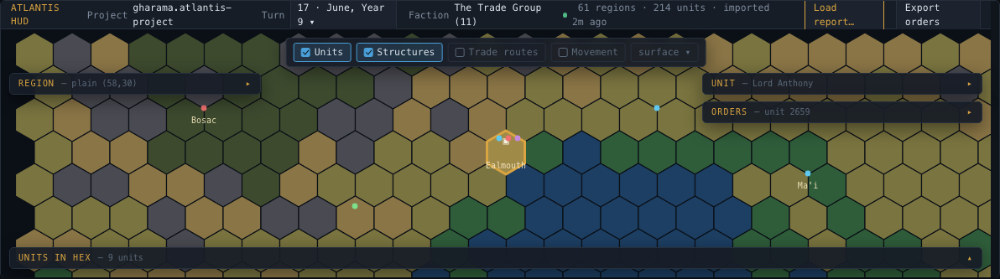
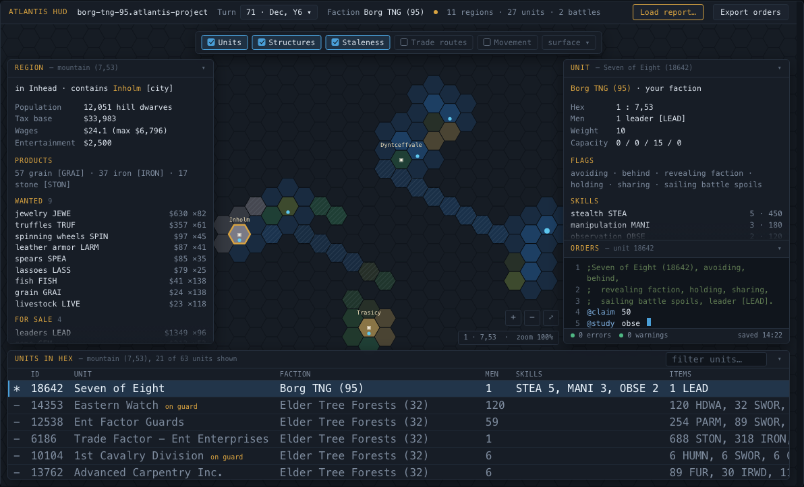
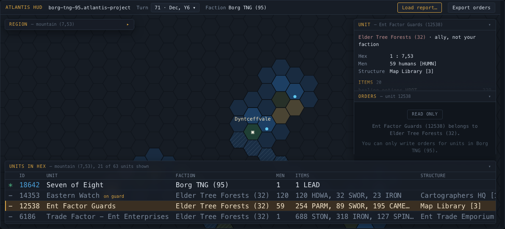
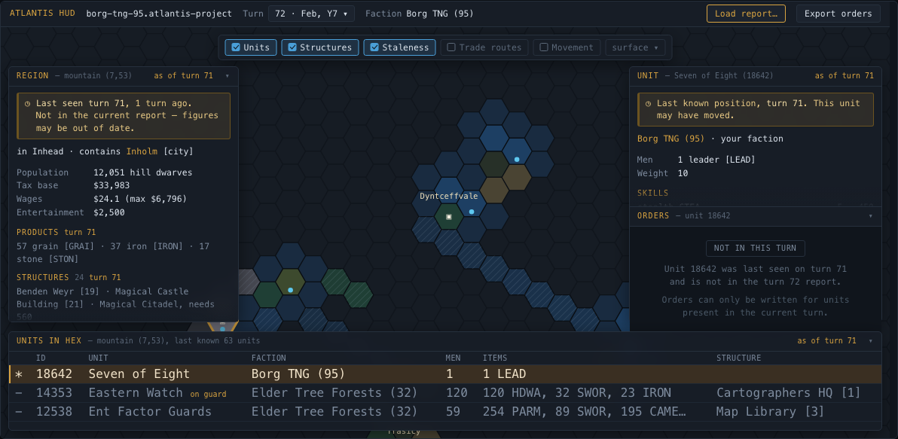
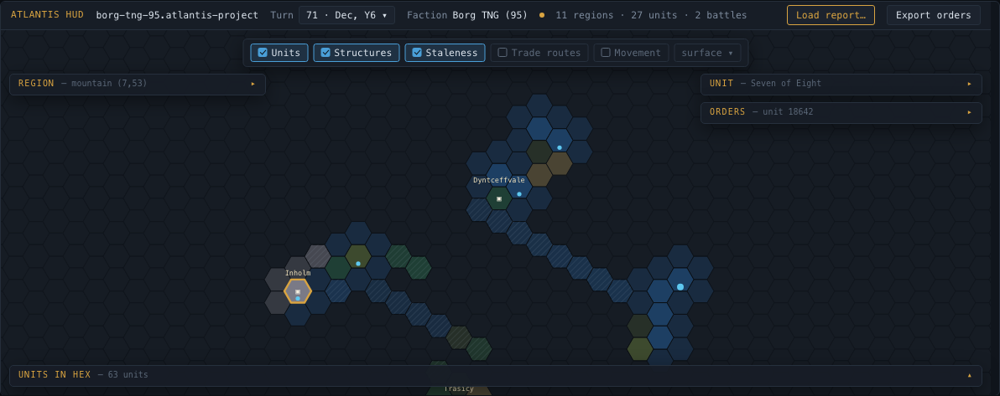

# UI design proposals (issue #17)

Design artefacts for issue #17, "Basic UI for the app". These are **mockups**, not application
code — they exist so the layout could be chosen before implementation starts.

For the graphical design of the map itself as implemented, see [hex-rendering.md](hex-rendering.md).
Five candidate directions for a future hex design are drawn in
[hex-design-proposals.html](hex-design-proposals.html), and
[map-themes.md](map-themes.md) describes the theme engine those designs plug into, including how to
add or remove a map theme. All five designs drawn in the proposals ship, and the map opens on
Cartographer's Table. A sixth theme, Classic — the map as it looked before the designs arrived —
was retired once they had all landed.

## Files

| File | What it is |
|---|---|
| `layout-proposals.html` | The four candidate layouts, side by side, with trade-offs for each. |
| `chosen-layout-turn71.html` | The chosen layout (variant 04) drawn from a real turn 71 report. |
| `mockups/*.png` | Rendered screenshots of both pages, referenced from issue #17. |
| `orders-export-descriptions.html` | Where the "keep the unit descriptions" option lives on the orders export (bead ah-52b). Three candidates; A, a second item in the Export menu, was chosen. |
| `region-problems-toggle.html` | What the control that hides the region panel's Problems section looks like (bead ah-f8u). Three candidates; 1, a chip in the panel header, was chosen. |
| `faction-view.html` | Where the faction's attitudes, allowances and unclaimed silver are read (bead ah-vp3.2). Three placements and three ways of setting out 32 declared factions; A, a popover anchored off the faction name in the header, was chosen, with a line per attitude level. |
| `region-decorations.html` | How a province is drawn on the map (bead ah-6zv). Three treatments, three rules for a province found in two pieces, and three homes for the switch; C, the atlas label, was chosen, every connected piece is outlined and named, and the switch is a `Regions` entry in the Badges menu. |
| `battles-view.html` | Where the turn's battles are read (bead ah-1is.2). Three candidates; B, one dialog with the battle list beside the battle, was chosen, and a list line states its outcome neutrally as attacker and defender losses. |
| `region-borders.html` | How bold a province outline needs to be to read against the hex lattice at every zoom (bead ah-f9c). Treatments over three simulated theme grounds and a far-zoom strip; Option B1 — a 3px screen-constant dashed line over a 5.5px screen-constant halo, in each theme's own ink — was chosen. |
| `panel-split-resize.html` | How the drag handle between the unit panel and the orders editor announces itself (bead ah-13o). Two live, draggable candidates plus the folded and limit-reached states; B, the always-visible grip pill in the existing gap, was chosen. |
| `hex-notes.html` | Where a player's own note on a hex is written and how it is drawn on the map (bead ah-o1t, issue #261). Two homes for the editor, three map treatments and two switch placements, plus the states; A — a Notes section in the region panel — was chosen, with a pin on the map that opens into a stack of tags on click, and a `Notes` entry in the Badges menu. |
| `units-pane-drag-resize.html` | Dragging the "Units in hex" pane to size it, replacing the row-count setting (bead ah-2r3). Two live candidates for what a dragged height means on a short list, snap vs free pixels, the bounds, and the folded, keyboard, empty and short-window states; A — the dragged height is the height — with free pixels, a one-row floor and a 70% ceiling was chosen. |
| `backup-import-collision.html` | What importing a game backup does when that game is already here (bead ah-c0m). Three candidates plus the states; B — an inline Replace / Keep both / Cancel confirmation in the picker's *This game* tab — was chosen, with the copy named “<name> (imported)”. |
| `rename-game.html` | Where a game is renamed (bead ah-lkw). Three homes plus the states; A — a Rename link on the Name row of the picker's *This game* tab, opening an in-place field with Save / Cancel — was chosen; an empty name is refused with creation's words, a duplicate only warns. |
| `map-levels.html` | What the player sees once the nexus and the underworld are levels of their own rather than filed on the surface (bead ah-4b4). Four questions with the states drawn: the level control uses the report’s own words (nexus / surface / underworld, shallowest first), the nexus is remembered like any hex, an unexplored hex off the surface is described “in the underworld”, and hex labels stay `terrain (x,y) in Province`. |
| `status-line-tones.html` | Which header status-line messages a player sees and in what colour once the line has a tone of its own rather than import flags (bead ah-9gk). Three notice treatments, a tone table for every message the shell writes, and three rules for the turn-messages chip on a failure; A — a visible notice with a dim grey dot — was chosen, the tone table as proposed, and a failure never hides the chip. |
| `form-alias-reused.html` | What the player sees when the same FORM number is used twice in a hex this month (bead ah-yk7). Two anchorings and the states; A — one warning per repeat, on the repeat, naming the first use — was chosen, per hex as the rules scope it, with a new *Orders* group in the Warnings tab. |

The layout pages answered issue #17 and are kept as the record of that decision. Pages added later
answer one bead each and are named after the question they settle, not after the layout — the table
above says which bead each belongs to.

Open any HTML file directly in a browser. They are self-contained: no build step, no external
assets, no network access. The hex maps are inline SVG generated by a short inline script.

## The four candidates

| # | Name | Map area | Unit table width |
|---|---|---|---|
| 01 | Classic Commander | Large, never overlaid | Full window |
| 02 | Three-Column Workbench | ~Half the window | Centre column only |
| 03 | Map-First Inspector | Whole window | Narrow drawer, 3–4 columns |
| **04** | **Docked Inspector** *(chosen)* | **Whole window** | **Full window, collapsible** |

Variant 04 was chosen because it resolves the trade-off that made 01 and 03 each imperfect: the
unit table needs horizontal room for faction, men, silver, skills, items and structure, while the
map wants the whole window. Making the table a collapsible overlay rather than a fixed row gets
both, and moving report state into the application header removes the one panel that never needed
to sit next to the map.

### 01 — Classic Commander

Map left, region above unit in a right rail, units table beside orders in a bottom dock. The shape
every reference client converged on. Nothing ever overlays the map, but a third of the window is
permanently chrome.

### 02 — Three-Column Workbench

Reports and region pinned left, map and units table centre, unit and orders right. Every widget
permanently visible and the simplest to build and test, but the map is squeezed to about half the
window.

### 03 — Map-First Inspector

Full-bleed map with floating drawers. Best map area, but the unit table is confined to a narrow
drawer that fits only three or four columns.

### 04 — Docked Inspector (chosen)

Full-bleed map, report state in the header, a screen-wide collapsible units dock, region left, unit
and orders right.

Collapse all four panels and the map opens to the full window, each panel leaving a title strip:

## The chosen layout on real data

Drawn from a real NewOrigins turn 71 report: Borg TNG (95), December Year 6, 4,028 lines,
11 regions in this turn's report, 45 more known by name, 92 units in the selected hex.

Selecting a **foreign** unit still fills the unit panel — foreign units are legitimate to inspect —
but the orders panel refuses the edit rather than offering a disabled text box:

Selecting a **previously visited** region shows the data held from the last sighting, banner-stamped
so it can never be mistaken for current. Orders are refused for a second, distinct reason: the unit
is not in the current turn.

Collapsed, showing all four map states at once — current, previously visited (hatched and
age-faded), known by name (faded), and unexplored:

## What these mockups established

Drawing against real NewOrigins reports rather than placeholder data surfaced several things that
changed the implementation plan:

- **Hexes are flat-top.** Atlantis exits are N, S, NE, SE, NW, SW; a direct northern neighbour means
  flat-top, not pointy-top. The mapping is `px = x * 1.5R`, `py = y * (sqrt(3)R/2)`, and only
  coordinates where `x + y` is even are valid. `packages/shared/src/PixiHexMap.tsx` currently draws
  pointy-top, and `packages/shared/src/mapData.ts` parses `"A1"`-style region ids that this ruleset
  never emits — it emits `(7,53)`.
- **Unit ownership is explicit in the report.** `*` prefixes your own units, `-` foreign ones, and
  `+` a structure whose units are nested beneath it. The read-only rule for foreign units needs no
  inference.
- **The orders document ships inside the report**, as the `Orders Template (Long Format)` section.
  It already contains the `#atlantis` line, per-region banners, per-unit comment blocks and live
  orders. Import seeds the order draft from it. That line carries the faction password, so export
  must round-trip it and it must never be logged.
- **The map has four states**, not two: current, previously visited (data held but possibly stale),
  known by name only (from another region's `Exits` block), and unexplored. Staleness makes region
  records turn-versioned, so persistence needs a per-region last-seen turn.
- **Regions can be large.** One region in the turn 71 report holds 92 units across 24 structures,
  74 of them inside those structures, so the unit table needs virtualising and the side panels need
  summarise-then-expand. (The mockups say 63, a figure asserted before anyone counted; the parser
  in #19 counts 92 and asserts it in tests.)

## Caveats

- The set of "previously visited" hexes in `chosen-layout-turn71.html` is **illustrative**. Only one
  turn is available for that faction, so there is no genuine visit history to draw from. The state,
  its rendering and its behaviour are real; which specific hexes are stale is not.
- Colour, spacing and type here are indicative. The implementation uses Tailwind tokens as specified
  in `docs/implementation-plan.md`, and light/dark theming is issue #9's scope.
- The maps here are SVG, and so is the real renderer. It began on PixiJS and moved to SVG in #58,
  because a canvas bakes each label into a texture at one size: zoomed in, a settlement name was a
  nine-pixel bitmap magnified threefold. The stale hatch and the settlement glyph drawn here were
  part of that move.
